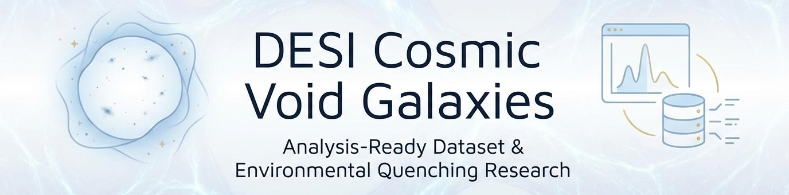
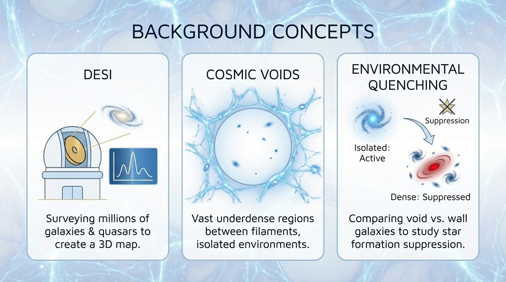
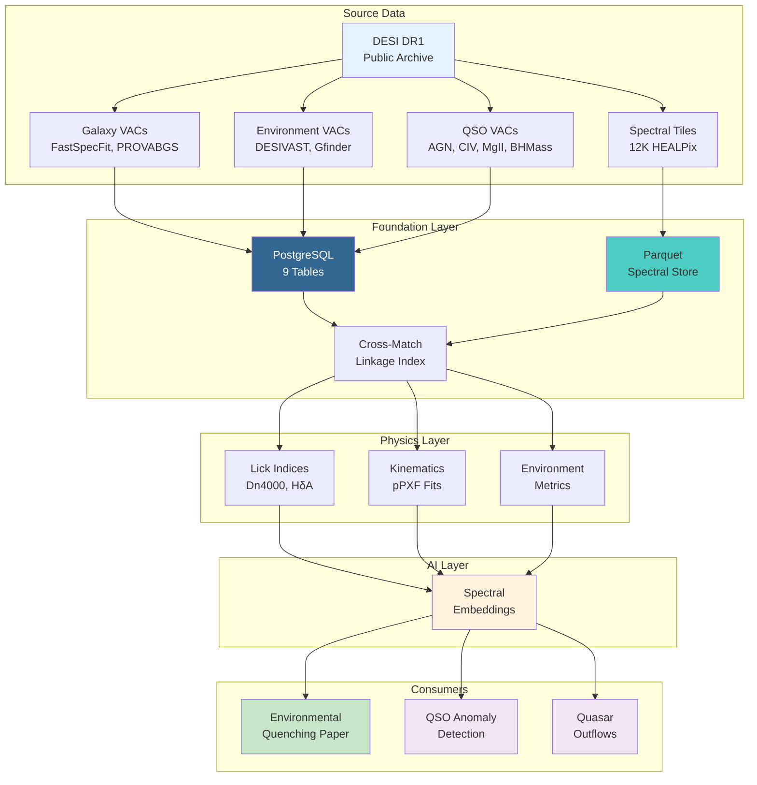

<!--
---
title: "DESI Cosmic Void Galaxies"
description: "Analysis-Ready Dataset factory for DESI DR1 + environmental quenching research"
author: "VintageDon"
date: "2026-03-29"
version: "3.1"
status: "Active"
tags:
  - type: project-root
  - domain: [ard, void-science, data-engineering]
  - tech: [python, postgresql, parquet, desi]
related_documents:
  - "[ARD Specification](https://github.com/radioastronomyio/analysis-ready-dataset)"
  - "[QSO Anomaly Detection](https://github.com/radioastronomyio/desi-qso-anomaly-detection)"
  - "[Quasar Outflows](https://github.com/radioastronomyio/desi-quasar-outflows)"
---
-->

# 🌌 DESI Cosmic Void Galaxies



[](https://data.desi.lbl.gov/doc/releases/dr1/)
[](https://www.postgresql.org/)
[](https://www.python.org/)
[](LICENSE)

> The first Analysis-Ready Dataset (ARD) for astronomy: a three-layer enriched dataset built from DESI DR1, with environmental quenching research as the proving ground.

This repository builds an enriched, analysis-ready dataset from DESI Data Release 1, combining galaxy catalogs, void classifications, QSO properties, and spectral data into a unified resource. The environmental quenching study, comparing galaxy properties in cosmic voids versus walls, serves as the first consumer application and validation of the ARD architecture.

Two downstream projects depend on this ARD:

- [desi-qso-anomaly-detection](https://github.com/radioastronomyio/desi-qso-anomaly-detection) — ML anomaly detection on QSO spectra
- [desi-quasar-outflows](https://github.com/radioastronomyio/desi-quasar-outflows) — AGN feedback and outflow energetics

---

## 🔭 Background

This section provides brief context for those less familiar with the domain. If you already know DESI and void science, skip to [Quick Start](#-quick-start).



[DESI](https://www.desi.lbl.gov/) (Dark Energy Spectroscopic Instrument) is a ground-based survey collecting spectra for tens of millions of galaxies and quasars to map the universe's large-scale structure. [Data Release 1](https://data.desi.lbl.gov/doc/releases/dr1/) includes spectra for over 18 million unique targets with derived physical properties like stellar mass and star formation rate.

Cosmic voids are vast underdense regions in the universe's large-scale structure, essentially the "bubbles" between the filaments and walls of the cosmic web. Galaxies in voids experience minimal environmental interactions (no mergers, no ram-pressure stripping), making them ideal laboratories for studying intrinsic galaxy evolution.

Environmental quenching refers to the suppression of star formation in galaxies due to their surroundings. By comparing void galaxies (isolated) to wall galaxies (in denser environments), we can disentangle "nature" (mass-driven evolution) from "nurture" (environment-driven effects). This is one of the fundamental open questions in galaxy evolution. Recent work using [DESI DR1 BGS data](https://arxiv.org/abs/2507.17243) has shown that void galaxies tend to be fainter, less massive, and more star-forming compared to wall galaxies.

---

## 🎯 Quick Start

Navigate to what you need based on your interest.

### For Researchers

- [📊 Data Dictionary](docs/ARD-DATA-DICTIONARY-v2.md) — Schema reference for catalog columns
- [📐 ARD Schema](docs/ARD-SCHEMA-v2.md) — Table structure and relationships
- [🔬 Phase 04: ARD Foundations](work-logs/04-ard-foundations/README.md) — Current architecture work
- [📈 Validation Results](work-logs/02-catalog-validation/README.md) — Quality checks and sample characteristics

### For Data Engineers

- [🏗️ Work Logs](work-logs/README.md) — Complete development history by milestone
- [📦 Spectral Pipeline](work-logs/03-spectral-tile-pipeline/README.md) — FITS to Parquet conversion (2.3TB to 32GB)
- [🗄️ Catalog ETL](work-logs/01-catalog-acquisition/README.md) — PostgreSQL ingestion pipeline

### For Downstream Consumers

- [📁 ARD Output](desi-cosmic-voids-ard/README.md) — Where materialized products will live
- [🔗 ARD Specification](https://github.com/radioastronomyio/analysis-ready-dataset) — Domain-agnostic methodology

---

## 📊 Dataset at a Glance

Current data assets built from DESI DR1 public releases.

### Catalog Data (PostgreSQL)

| Asset | Count | Source | Status |
|-------|-------|--------|--------|
| Galaxy catalog | 6,445,927 rows | FastSpecFit VAC | ✅ Ingested |
| Post-QA sample | 6,342,556 rows | Quality cuts applied | ✅ Validated |
| Void catalog | 10,752 voids | DESIVAST (4 algorithms) | ✅ Ingested |
| Environmental classifications | derived | Void/wall assignment | 🔄 In Progress |

### Spectral Data (Parquet)

| Metric | Value | Notes |
|--------|-------|-------|
| HEALPix tiles processed | 10,800+ | 88.5% of 12,207 total |
| Original FITS size | ~2.3 TB | From DESI S3 archive |
| Parquet output | ~32 GB | 98.6% compression |
| Production runtime | 61 hours | Zero manual intervention |

### Sample Characteristics

| Property | Range | Notes |
|----------|-------|-------|
| Redshift | z ∈ [0.001, 1.0] | BGS-dominated sample |
| Stellar mass | log(M★/M☉) ∈ [6, 13] | Full mass range |
| Void algorithms | 4 | VIDE, ZOBOV, REVOLVER, VoidFinder |
| Sky coverage | RA [0°, 360°], DEC [-35°, 90°] | DESI footprint |

---

## 🗃️ Value-Added Catalogs

This ARD integrates 9 DESI DR1 Value-Added Catalogs across galaxy and QSO domains.

### Galaxy VACs

| VAC | Purpose | Key Columns | Link |
|-----|---------|-------------|------|
| FastSpecFit | Stellar continuum + emission lines | stellar_mass, sfr, dn4000 | [docs](https://data.desi.lbl.gov/doc/releases/dr1/vac/fastspecfit/) |
| PROVABGS | Bayesian SED fitting with posteriors | stellar_mass_p50, sfr_p50, age | [docs](https://data.desi.lbl.gov/doc/releases/edr/vac/provabgs/) |
| DESIVAST | Cosmic void classifications | void_id, algorithm, effective_radius | [docs](https://data.desi.lbl.gov/doc/releases/dr1/vac/desivast/) |
| Gfinder | Halo-based group catalog | group_id, halo_mass, richness | [docs](https://data.desi.lbl.gov/doc/releases/dr1/vac/gfinder/) |

### QSO VACs

| VAC | Purpose | Key Columns | Link |
|-----|---------|-------------|------|
| AGN/QSO | Spectral + IR classification | agn_type, wise_agn_flag | [docs](https://data.desi.lbl.gov/doc/releases/dr1/vac/agnqso/) |
| CIV Absorber | Intervening CIV systems | ew_civ, z_abs, vdisp | [docs](https://data.desi.lbl.gov/doc/releases/dr1/vac/civ-absorber/) |
| MgII Absorber | Intervening MgII systems | ew_mgii, z_abs | [docs](https://data.desi.lbl.gov/doc/releases/dr1/vac/mgii-absorber/) |
| QMassIron | Black hole masses | mbh_mgii, lbol, eddington_ratio | [docs](https://data.desi.lbl.gov/doc/releases/dr1/vac/qmassiron/) |
| Stellar Mass/EmLine | CIGALE masses + emission lines | mass_cg, oii_flux, oiii_flux | [docs](https://data.desi.lbl.gov/doc/releases/dr1/vac/stellar-mass-emline/) |

---

## 🏗️ ARD Architecture

The Analysis-Ready Dataset employs a three-layer enrichment model, with PostgreSQL as the materialization engine and Parquet as the distribution format.



### Layer Descriptions

| Layer | Content | Status |
|-------|---------|--------|
| Foundation | Unified catalog + spectral linkage + environmental classifications | 🔄 In Progress |
| Physics | Derived quantities: Lick indices, pPXF kinematics, SED posteriors | ⬜ Planned |
| AI/Embeddings | Neural spectral embeddings, similarity metrics | ⬜ Planned |

---

## 🚀 Project Status

Development organized into phases, following a milestone-based structure.

| Phase | Name | Status | Date | Key Outcome |
|-------|------|--------|------|-------------|
| 01 | [Catalog Acquisition](work-logs/01-catalog-acquisition/README.md) | ✅ Complete | Jul 2025 | 6.4M galaxies + 10.7K voids in PostgreSQL |
| 02 | [Catalog Validation](work-logs/02-catalog-validation/README.md) | ✅ Complete | Aug 2025 | 3-stage QA, 98.4% retention |
| 03 | [Spectral Pipeline](work-logs/03-spectral-tile-pipeline/README.md) | ✅ Complete | Sep 2025 | 10.8K tiles, 98.6% compression |
| 04 | [ARD Foundations](work-logs/04-ard-foundations/README.md) | ✅ Complete | Dec 2025 | Schema v2.0, 9 VACs, Data Dictionary |
| 05 | VAC ETL Sprint | ⬜ Next | 2026 | Ingest remaining 7 VACs |

### Work Tiers

Tasks are categorized by complexity for planning purposes.

| Tier | Characteristics | Examples |
|------|-----------------|----------|
| Easy | SQL-based, no spectral dependency | Lick indices, sSFR derivation, k-NN density |
| Medium | Established tools, compute time | pPXF kinematics, spectral QA, cross-match index |
| Hard | Significant engineering | Bagpipes SED fitting, embedding generation |

---

## 📁 Repository Structure

```
desi-cosmic-void-galaxies/
├── 📂 assets/                        # Images, diagrams, banners
├── 📂 config/                        # Configuration files
├── 📂 data/                          # Large files (LFS tracked)
├── 📂 desi-cosmic-voids-ard/         # ARD output directory
├── 📂 docs/
│   ├── 📂 documentation-standards/   # Templates, tagging strategy
│   ├── 📄 ARD-SCHEMA-v2.md           # Table structure reference
│   └── 📄 ARD-DATA-DICTIONARY-v2.md  # Column definitions
├── 📂 internal-files/                # Working documents
├── 📂 output/                        # Processing outputs
├── 📂 shared/                        # Cross-cutting assets (SQL schemas, etc.)
├── 📂 spec/                          # Specifications
├── 📂 staging/                       # Staged work
├── 📂 work-logs/                     # Milestone-based development history
│   ├── 📂 01-catalog-acquisition/
│   ├── 📂 02-catalog-validation/
│   ├── 📂 03-spectral-tile-pipeline/
│   └── 📂 04-ard-foundations/
├── 📄 AGENTS.md                      # Agent instructions
├── 📄 CLAUDE.md                      # Pointer to AGENTS.md
├── 📄 ROADMAP.md                     # Full phase plan
├── 📄 LICENSE
├── 📄 LICENSE-DATA
└── 📄 README.md                      # This file
```

---

## 🖥️ Infrastructure

This project runs on the [radioastronomy.io](https://github.com/radioastronomyio/proxmox-astronomy-lab) research cluster.

| Resource | Host | Purpose |
|----------|------|---------|
| PostgreSQL 16 | radio-pgsql01 (10.25.20.8) | Catalog storage, materialization engine |
| Spectral tiles | radio-fs02 (10.25.20.15) | Parquet storage |
| GPU compute | ML01 (A4000, 16GB) | ML training, embedding generation |

---

## 🔗 Related Projects

### DESI Research Portfolio

| Project | Focus | Relationship |
|---------|-------|--------------|
| This repo | ARD factory + environmental quenching | Central data provider |
| [desi-qso-anomaly-detection](https://github.com/radioastronomyio/desi-qso-anomaly-detection) | ML outlier detection in QSO spectra | Downstream consumer |
| [desi-quasar-outflows](https://github.com/radioastronomyio/desi-quasar-outflows) | AGN feedback energetics | Downstream consumer |

### Supporting Resources

| Resource | Description |
|----------|-------------|
| [analysis-ready-dataset](https://github.com/radioastronomyio/analysis-ready-dataset) | Domain-agnostic ARD methodology |
| [astronomy-rag-corpus](https://github.com/radioastronomyio/astronomy-rag-corpus) | Literature corpus supporting DESI research |
| [proxmox-astronomy-lab](https://github.com/radioastronomyio/proxmox-astronomy-lab) | Infrastructure documentation |
| [DESI DR1 Portal](https://data.desi.lbl.gov/doc/releases/dr1/) | Official data documentation |
| [DESIVAST VAC](https://data.desi.lbl.gov/doc/releases/dr1/vac/desivast/) | Void catalog source |
| [FastSpecFit VAC](https://data.desi.lbl.gov/doc/releases/dr1/vac/fastspecfit/) | Galaxy properties source |

---

## 📜 License

This project is licensed under the MIT License. See [LICENSE](LICENSE) for details.

---

## 🙏 Acknowledgments

- [DESI Collaboration](https://www.desi.lbl.gov/) for Data Release 1 public data
- DESIVAST Team for void catalog across 4 algorithms
- FastSpecFit Team for galaxy stellar population measurements
- radioastronomy.io research cluster for infrastructure

---

Last Updated: 2026-03-29 | Current Phase: ARD Foundations Complete, VAC ETL Sprint Next
